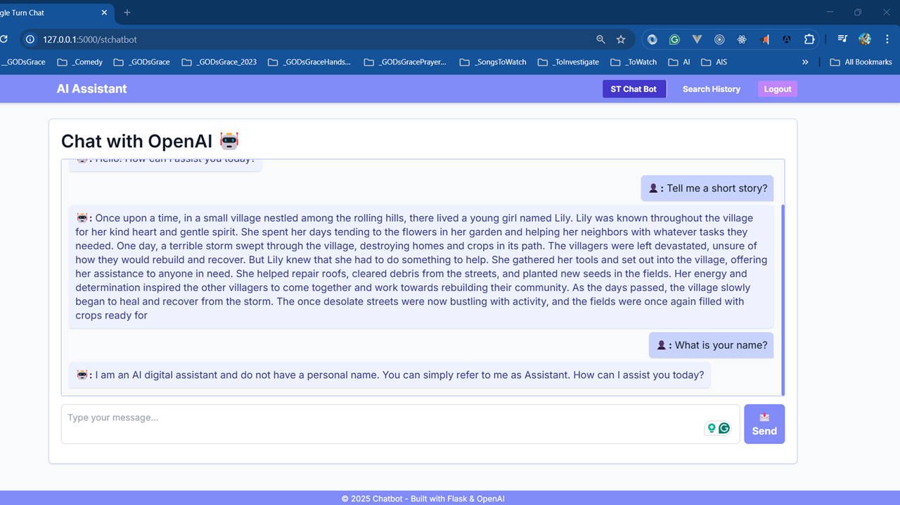

# Chat BOT with Flask and OpenAI

I am learning creating Chat Bot with Flask from different Video Courses, Books, and Websites

## UI Preview



## Project Structure

```text
openai-chat-flask/
│
├── app.py                  # Main entry point
├── requirements.txt        # List of dependencies
├── .env                    # Environment variables (e.g., API keys)
├── README.md               # Documentation (optional)
│
├── website/                # Your Flask package
│   ├── __init__.py         # Initializes the Flask app, config, and DB
│   ├── routes.py           # Blueprint for all routes (views & API endpoints)
│   ├── models.py           # (Optional) Database models if using SQLAlchemy
│   ├── static/             # Static files (CSS, JS, images)
│   │   └── globalstyles.css    # Custom CSS (optional)
│   └── templates/          # HTML templates (Jinja2)
│       ├── base.html       # Base template with common layout (navbar, footer)
│       ├── index.html      # Main page template (chat UI)
│       ├── history.html    # (Optional) Chat history template
│       └── response_view.html  # (Optional) Response view template
```

## Project Setup

```powershell
python --version
pip --version

pip install virtualenv
python -m venv .venv
.venv/Scripts/activate
python -m pip install --upgrade pip

pip install flask openai python-dotenv flask_sqlalchemy

pip freeze > requirements.txt
pip install -r .\requirements.txt
```

---

Below is a complete, organized document for your scalable Flask chatbot project with separation of concerns. This example uses a modular, blueprint-based structure and includes a dedicated folder for database models.

---

## **Folder Structure**

```
openai-chat-flask/
├── app.py                  # Entry point of the application
├── requirements.txt        # List of Python dependencies
├── .env                    # Environment variables (e.g., API keys, secret key)
├── README.md               # Project documentation (optional)
└── website/                # Main package for your Flask app
    ├── __init__.py         # Initializes the Flask app, configures database, and registers blueprints
    ├── models.py           # Database models (SQLAlchemy models)
    ├── views/              # Folder for view routes (HTML rendering)
    │   ├── __init__.py     # Initializes the views blueprint
    │   └── home.py         # Contains routes for Home, ST Chat Bot, History pages
    ├── api/                # Folder for API endpoints
    │   ├── __init__.py     # Initializes the API blueprint
    │   └── chat.py         # Contains the chat API endpoint (interacts with OpenAI)
    ├── static/             # Static files (CSS, images, etc.)
    │   ├── favicon.ico
    │   └── globalstyles.css
    └── templates/          # Jinja2 templates
        ├── base.html       # Base template with navbar, footer, etc.
        ├── home.html       # Home page (information about the application)
        ├── stchatbot.html  # Single Turn Chat Bot page (chat UI)
        └── history.html    # Search History page (placeholder or chat history)
```

---

## **Step-by-Step Setup**

### **1. Create the Project Folder & Virtual Environment**

Open your terminal in your project folder and run:

```bash
python -m venv .venv
```

Activate the virtual environment:

- **Windows (PowerShell):**
  ```powershell
  .\.venv\Scripts\Activate
  ```
- **macOS/Linux:**
  ```bash
  source .venv/bin/activate
  ```

---

### **2. Create the `requirements.txt` File**

In the project root, create a `requirements.txt` file with the following dependencies (adjust versions as needed):

```txt
Flask==2.1.3
Flask-SQLAlchemy==2.5.1
python-dotenv==0.20.0
openai==0.20.0
```

Install dependencies:

```bash
pip install -r requirements.txt
```

---

### **3. Create the `.env` File**

Create a `.env` file in the project root (this file should be ignored by Git):

```env
OPENAI_API_KEY=your_openai_api_key_here
SECRET_KEY=your_secret_key_here
```

---

### **4. Application Entry Point: `app.py`**

Create `app.py` in the project root:

```python
# app.py
from website import create_app

app = create_app()

if __name__ == '__main__':
    app.run(debug=True)
```

---

### **5. Flask App Initialization: `website/__init__.py`**

Create `website/__init__.py` to initialize the Flask app, configure settings, and register blueprints:

```python
# website/__init__.py
from flask import Flask
from flask_sqlalchemy import SQLAlchemy
from os import path
from dotenv import load_dotenv
import os

load_dotenv()  # Load environment variables from .env

db = SQLAlchemy()
DB_NAME = "database.db"

def create_app():
    app = Flask(__name__)

    # App configuration
    app.config['SECRET_KEY'] = os.getenv("SECRET_KEY", "SimpleSecretKey")
    app.config['SQLALCHEMY_TRACK_MODIFICATIONS'] = False
    app.config['SQLALCHEMY_DATABASE_URI'] = f"sqlite:///{DB_NAME}"

    # Initialize database
    db.init_app(app)

    # Register Blueprints for views and API
    from .views import views
    from .api import api
    app.register_blueprint(views, url_prefix="/")
    app.register_blueprint(api, url_prefix="/api")

    # Create the database if it doesn't exist
    with app.app_context():
        if not path.exists("website/" + DB_NAME):
            db.create_all()
            print("Database Created")

    return app
```

---

### **6. Database Models: `website/models.py`**

Create `website/models.py` to define your SQLAlchemy models. For example:

```python
# website/models.py
from . import db

class ChatHistory(db.Model):
    id = db.Column(db.Integer, primary_key=True)
    user_message = db.Column(db.Text, nullable=False)
    bot_response = db.Column(db.Text, nullable=False)
    timestamp = db.Column(db.DateTime, default=db.func.now())
```

You can extend this model or add additional models as your project grows.

---

### **7. View Routes: `website/views/__init__.py` and `website/views/home.py`**

#### **7.1. `website/views/__init__.py`:**

```python
# website/views/__init__.py
from flask import Blueprint

views = Blueprint('views', __name__)

from .home import *
```

#### **7.2. `website/views/home.py`:**

```python
# website/views/home.py
from flask import render_template
from . import views

@views.route("/")
def home():
    return render_template("home.html")

@views.route("/stchatbot")
def stchatbot():
    return render_template("stchatbot.html")

@views.route("/history")
def history():
    return render_template("history.html")
```

---

### **8. API Routes: `website/api/__init__.py` and `website/api/chat.py`**

#### **8.1. `website/api/__init__.py`:**

```python
# website/api/__init__.py
from flask import Blueprint

api = Blueprint('api', __name__)

from .chat import *
```

#### **8.2. `website/api/chat.py`:**

```python
# website/api/chat.py
from flask import request, jsonify, current_app
import openai
import os
from . import api

# Ensure API key is set
openai_api_key = os.getenv("OPENAI_API_KEY")
if not openai_api_key:
    raise ValueError("Missing OpenAI API Key. Set OPENAI_API_KEY in environment variables.")
openai.api_key = openai_api_key

@api.route("/chat", methods=["POST"])
def chat():
    data = request.get_json()
    user_message = data.get("message", "").strip()
    if not user_message:
        return jsonify({"error": "No message provided"}), 400
    try:
        response = openai.ChatCompletion.create(
            model="gpt-3.5-turbo",
            messages=[{"role": "user", "content": user_message}],
            temperature=0.7,
            max_tokens=200
        )
        bot_message = response["choices"][0]["message"]["content"]
        return jsonify({"response": bot_message})
    except Exception as e:
        current_app.logger.error(f"Error in OpenAI API call: {e}")
        return jsonify({"error": "An error occurred while fetching response."}), 500
```

---

### **9. Templates**

#### **9.1. Base Template: `website/templates/base.html`**

```html
<!DOCTYPE html>
<html lang="en">
  <head>
    <meta charset="UTF-8" />
    <meta name="viewport" content="width=device-width, initial-scale=1.0" />
    <title>
      Single Turn Chatbot with OpenAI
    </title>

    <!-- Google Fonts: Inter -->
    <link
      href="https://fonts.googleapis.com/css2?family=Inter:wght@300;400;600;700&display=swap"
      rel="stylesheet"
    />

    <!-- Favicon -->
    <link
      rel="icon"
      href="{{ url_for('static', filename='favicon.ico') }}"
      type="image/x-icon"
    />

    <!-- Tailwind CSS CDN -->
    <link
      href="https://cdn.jsdelivr.net/npm/tailwindcss@2.2.19/dist/tailwind.min.css"
      rel="stylesheet"
    />

    <!-- Custom Global Styles -->
    <link
      rel="stylesheet"
      href="{{ url_for('static', filename='globalstyles.css') }}"
    />
  </head>
  <body class="flex flex-col min-h-screen bg-gray-50 text-gray-900 font-inter">
    <!-- Navbar -->
    <nav class="bg-indigo-400 text-white shadow-md">
      <div
        class="container mx-auto px-4 py-2 flex justify-between items-center"
      >
        <a
          href="/"
          class="text-2xl font-bold px-4 py-1 rounded transition-colors duration-200 hover:bg-indigo-500 hover:text-white"
        >
          AI Assistant
        </a>
        <div class="space-x-4">
          <a
            href="/stchatbot"
            class="px-4 py-2 rounded transition-colors duration-200 hover:bg-indigo-500 hover:text-white font-bold"
          >
            ST Chat Bot
          </a>
          <a
            href="/history"
            class="px-4 py-2 rounded transition-colors duration-200 hover:bg-indigo-500 hover:text-white font-bold"
          >
            Search History
          </a>
          <button
            class="bg-purple-400 hover:bg-purple-600 px-3 py-1 rounded transition-colors duration-200 font-bold"
          >
            Logout
          </button>
        </div>
      </div>
    </nav>

    <!-- Main Content -->
    <main class="container mx-auto p-4 flex-grow">
      
    </main>

    <!-- Sticky Footer -->
    <footer
      class="bg-gray-800 text-white text-center p-2 text-md border-t border-gray-100"
    >
      © 2025 Chatbot - Built with Flask & OpenAI
    </footer>
  </body>
</html>
```

#### **9.2. Home Page: `website/templates/home.html`**

```html
 Home 
<div class="max-w-3xl mx-auto bg-white p-6 rounded-lg shadow">
  <h2 class="text-2xl font-bold mb-4">Welcome to the Single Turn Chat BOT</h2>
  <p class="mb-4">
    This application demonstrates a single-turn chat with Azure OpenAI. You can
    ask a question, and it will respond once per query.
  </p>
  <p class="mb-4"><strong>Features:</strong></p>
  <ul class="list-disc list-inside mb-4">
    <li>Single Turn Chat Bot (GPT-based)</li>
    <li>Search History to revisit previous queries</li>
    <li>Simple, responsive UI</li>
  </ul>
  <p class="mb-4">
    Use the navigation bar above to explore the chatbot or view your search
    history.
  </p>
</div>

```

#### **9.3. ST Chat Bot Page: `website/templates/stchatbot.html`**

_(This file should contain your chat interface code—use your current chat UI code here.)_

#### **9.4. History Page: `website/templates/history.html`**

```html
 Search History 
<div class="max-w-3xl mx-auto bg-white p-6 rounded-lg shadow">
  <h2 class="text-2xl font-bold mb-4">Search History</h2>
  <p>Coming soon...</p>
</div>

```

---

### **10. Custom Styles: `website/static/globalstyles.css`**

```css
/* Global font and basic styling */
body {
  font-family: "Inter", sans-serif;
  font-weight: 400;
}

/* Headings */
h1,
h2,
h3,
h4,
h5,
h6 {
  font-family: "Inter", sans-serif;
  font-weight: 600;
}

/* Paragraphs, spans, buttons, inputs, textarea */
p,
span,
button,
input,
textarea {
  font-family: "Inter", sans-serif;
  font-weight: 400;
}

/* Custom scrollbar styling for chat-box */
#chat-box::-webkit-scrollbar {
  width: 6px;
}

#chat-box::-webkit-scrollbar-thumb {
  background-color: #6366f1; /* Example: Indigo-400 */
  border-radius: 6px;
}

#chat-box::-webkit-scrollbar-thumb:hover {
  background-color: #4f46e5; /* Example: Indigo-600 */
}
```

---

## **11. Running Your Application**

1. **Activate your virtual environment:**

   ```bash
   .\.venv\Scripts\activate
   ```

2. **Install dependencies:**

   ```bash
   pip install -r requirements.txt
   ```

3. **Run your app:**

   ```bash
   python app.py
   ```

4. **Visit your pages:**
   - Home: [http://127.0.0.1:5000/](http://127.0.0.1:5000/)
   - ST Chat Bot: [http://127.0.0.1:5000/stchatbot](http://127.0.0.1:5000/stchatbot)
   - Search History: [http://127.0.0.1:5000/history](http://127.0.0.1:5000/history)

---

### **Summary**

- **Modular Folder Structure:**  
  The project is organized into separate folders for views, API endpoints, and models.
- **Blueprints:**  
  Views (HTML rendering) and API routes are in separate modules.
- **Database Models:**  
  Place your SQLAlchemy models in `website/models.py` for scalability.
- **Templates & Static Files:**  
  All HTML templates are in `website/templates/` and custom CSS in `website/static/`.
- **Environment Variables:**  
  The `.env` file is used for sensitive keys.
- **Navbar:**  
  The navbar includes links to Home, ST Chat Bot, and Search History, each with a tab-like hover effect.

This setup ensures separation of concerns and scalability as your project grows. Let me know if you have any further questions or need additional modifications!
